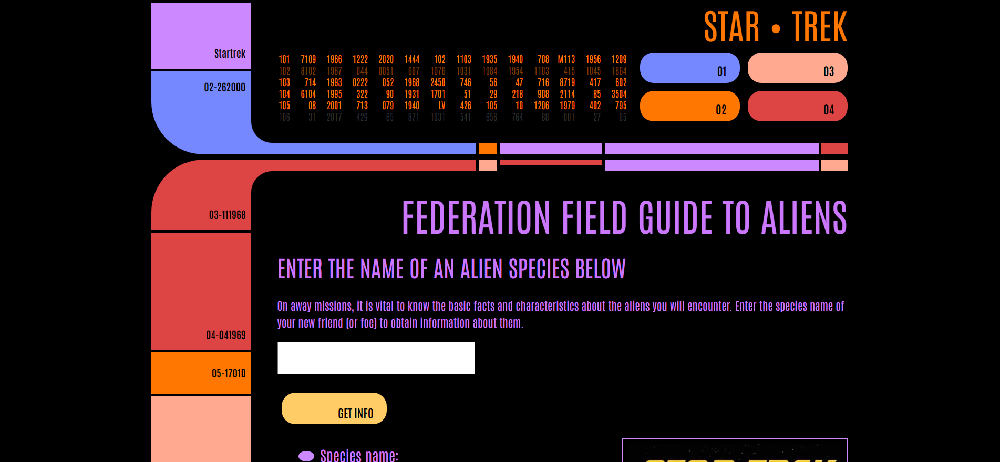

<h1 align='center'> Star Trek Alien App | <a href='https://hellomitchellh.github.io/star-trek-client-side/'>Visit here!</a></h1>

 

<h2> Project Context</h2>

 Star Trek-themed app that can fetch data from an <a href='https://github.com/hellomitchellh/star-trek-api-server-side'>API</a> (created by me) hosted on Heroku.

 
 
<h2>What was learned</h2>

<ul>
 <li>Writing code that enables the front-end and back-end of the web application to communicate with each other</li>
  <li>Using Async/Await instead of promises and try-catch block to catch exceptions</li>
  <li>Working with JSON data</li>
 
</ul>

 

<h2>Optimizations</h2>

Have the images maintain their aspect ratio but keep the same width.

 

<h2>Tech Used</h2>
<ul>
<li>HTML</li>
<li>CSS</li>
<li>JavaScript</li>
</ul>